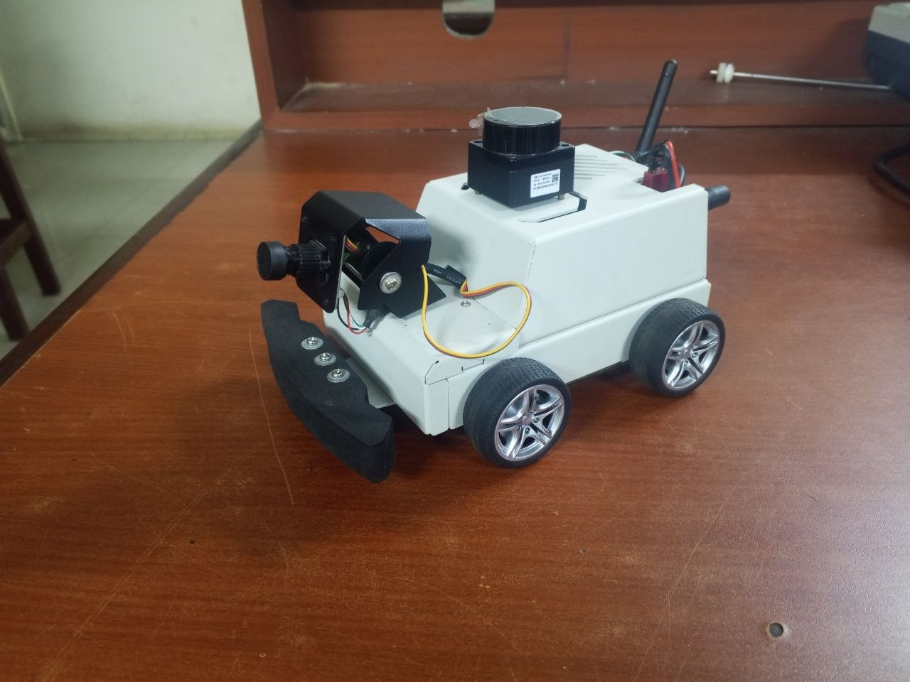

# Autonomous Mobile Robot Cognition System

[](https://docs.ros.org/en/humble/)
[](https://www.python.org/)
[](https://www.raspberrypi.com/)
[](https://www.iso.org/standard/69263.html)

Real-time human intention recognition on a physical mobile robot using hand gestures. No wearables, no cloud, no GPU — runs entirely on a Raspberry Pi 5 with a 132 ms end-to-end latency.

<p align="center">
  
</p>

---

## How It Works

```
USB Camera (20 Hz)
      ↓
MediaPipe Hand Landmarks (21 × 3D)
      ↓
19-D Geometric Feature Extraction (scale-invariant)
      ↓
MLP Classifier → STOP | GO | FOLLOW | LEFT | RIGHT | BACK
      ↓
Supervisory Brain FSM (5-frame consensus + 3s command lock)
      ↓
twist_mux (safety priority arbitration) ← LiDAR emergency preemption
      ↓
ESP32-S3 Differential Drive (micro-ROS, UART)
```

The system also integrates Nav2 autonomous navigation, SLAM Toolbox mapping, a 2-DOF camera gimbal with visual servoing, and an acoustic safety horn.

---

## Repository Layout

```
src_nodes/           ROS 2 perception and brain nodes
launch/              Launch files (master_robot.launch.py recommended)
config/              Nav2 planner, controller, costmap params
ml_models/
  ├── datasets/      Training CSVs
  ├── training/      Training scripts
  └── weights/       Production models (.pkl, .onnx)
scripts/             Deployment, diagnostics, mission tools
tests/               Automated test suite
maps/                SLAM occupancy grids
experiment_logs/     Physical trial data (180 trials)
write_up/            Undergraduate thesis (LaTeX)
docs/                Technical reference & operations guide
```

---

## Quick Start

**Interactive menu** (auto-detects robot on network):
```bash
./scripts/menu.sh
```

**Deploy to robot** (syncs nodes, models, configs via SSH):
```bash
./scripts/sync_to_bot.sh
```

**Launch full stack on robot:**
```bash
ros2 launch launch/master_robot.launch.py
```

**Run tests:**
```bash
python3 scripts/run_all_local_verifications.py
```

## Documentation

For detailed hardware setup, power-on sequences, SLAM mapping, Nav2 navigation, active vision operation, and troubleshooting, see the full operations guide:

📖 **[Robot Operations Manual & User Guide](docs/ROBOT_OPERATIONS_MANUAL_AND_USER_GUIDE.md)**

---

## Results

| Metric | Value |
| :--- | :--- |
| Gesture classification accuracy (6-class MLP) | 99.38% |
| Physical trial accuracy (180 trials) | 96.67% |
| End-to-end latency (camera → motor) | 132 ms |
| Multi-waypoint patrol | 15.89 m, 100% completion |
| Emergency stop distance | < 0.36 m |
