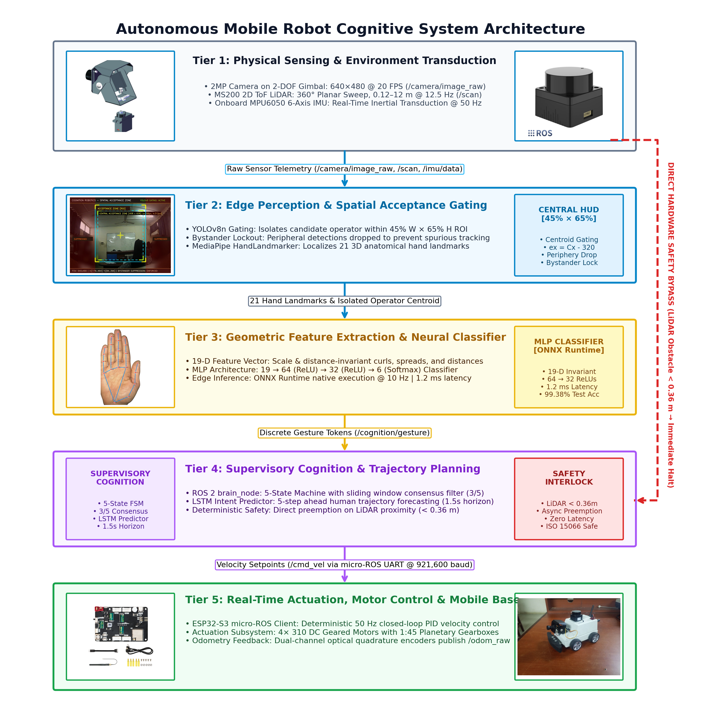
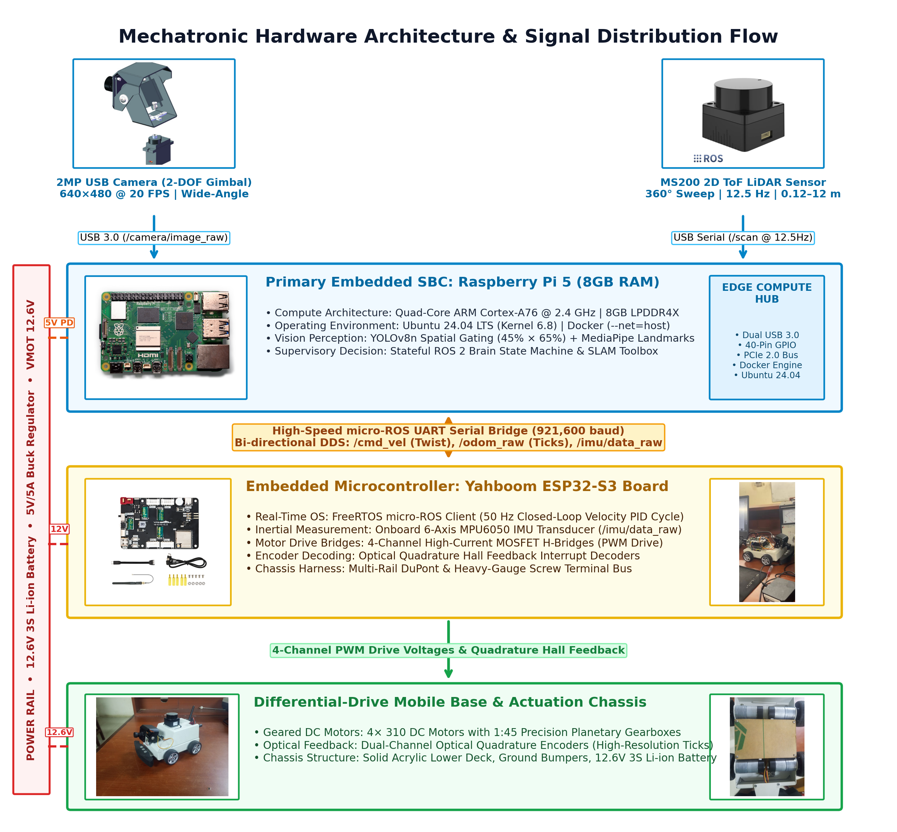
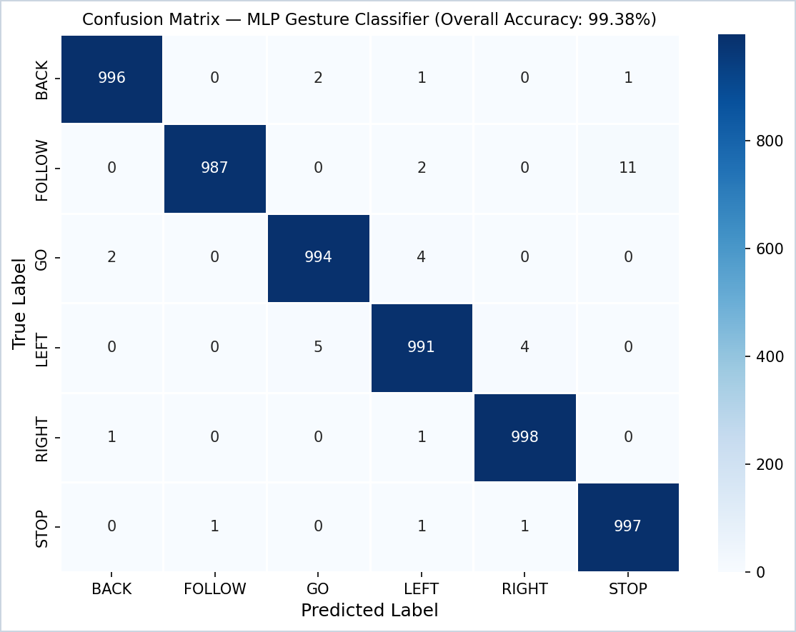
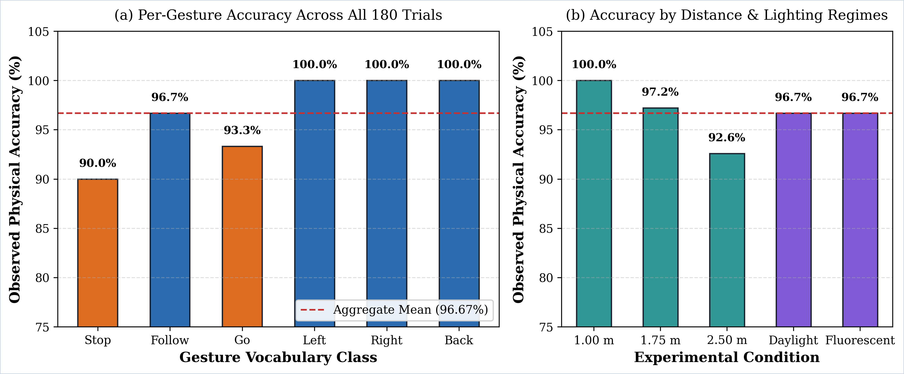
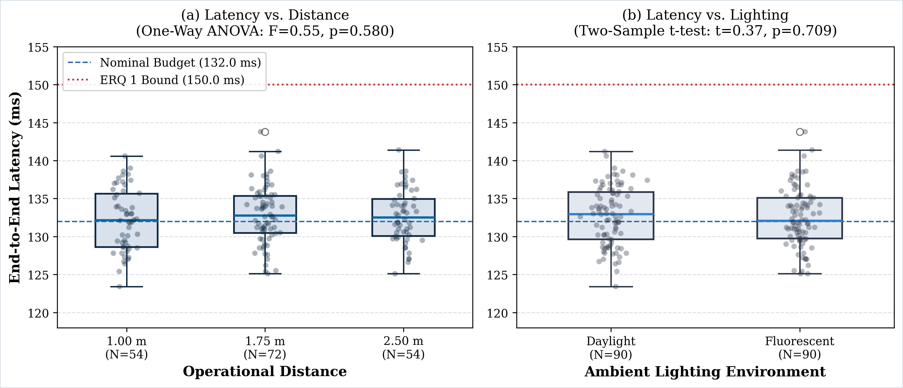
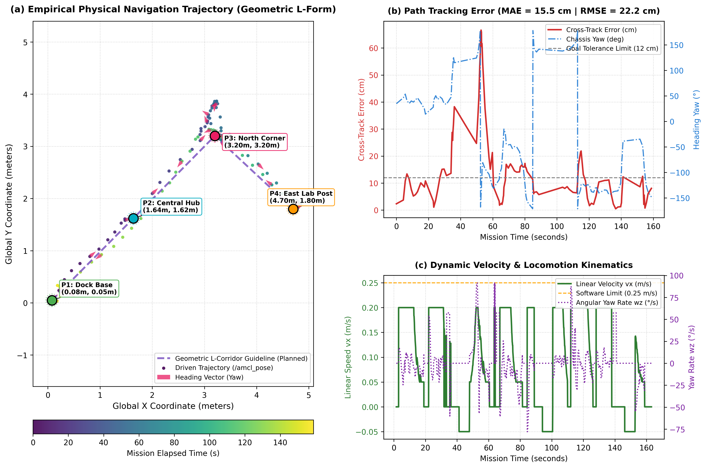

<![CDATA[# Autonomous Mobile Robot Cognition System

<h3 align="center">Human Intention Recognition Using Motion and Hand Gesture</h3>

<p align="center">
  
</p>

<p align="center">
  <a href="https://docs.ros.org/en/humble/"></a>
  <a href="https://ubuntu.com/"></a>
  <a href="https://www.python.org/"></a>
  <a href="https://www.raspberrypi.com/"></a>
</p>

<p align="center">
  <a href="https://micro.ros.org/"></a>
  <a href="https://www.iso.org/standard/69263.html"></a>
  
  
  
</p>

---

A **real-time, edge-deployed human intention recognition system** on a physical differential-drive mobile robot. An operator controls the robot entirely through hand gestures — no wearables, no cloud, no GPU. The full perception-to-actuation pipeline runs on a Raspberry Pi 5 within a 132 ms latency budget.

> **Institution:** Ghana Communication Technology University (GCTU), Faculty of Engineering — Department of Computer Engineering  
> **Authors:** Eleana & Joel  
> **Supervisor:** Mr. Michael Xenya

---

## Table of Contents

- [Features](#features)
- [System Architecture](#system-architecture)
- [Hardware Platform](#hardware-platform)
- [Repository Structure](#repository-structure)
- [Prerequisites](#prerequisites)
- [Installation](#installation)
- [Quick Start](#quick-start)
- [Running Tests](#running-tests)
- [Key Results](#key-results)
- [Standards Compliance](#standards-compliance)
- [Publications](#publications)
- [Citation](#citation)
- [License](#license)
- [Acknowledgements](#acknowledgements)

---

## Features

| Capability | Description |
| :--- | :--- |
| 🤚 **6-Class Gesture Recognition** | Real-time classification of `STOP`, `GO`, `FOLLOW`, `LEFT`, `RIGHT`, `BACK` using a 19-dimensional geometric invariant MLP |
| 🎯 **Position-Invariant** | Scale-invariant feature vectors enable reliable recognition at 1.0 m, 1.75 m, and 2.5 m operator distances |
| 👁️ **Active Vision** | 2-DOF pan/tilt camera gimbal with closed-loop PI visual servoing tracks the operator autonomously |
| 🧠 **Supervisory Brain FSM** | 5-frame rolling consensus + 3.0 s command lock + emergency LiDAR preemption for robust command arbitration |
| 🗺️ **Autonomous Navigation** | Nav2 + SLAM Toolbox; multi-waypoint room patrol (15.89 m path, 100% waypoint completion) |
| 🔒 **Safety** | ISO 15066:2016 compliant — reactive obstacle stop within 0.36 m with emergency reverse escape |
| ⚡ **Edge-Only Inference** | Full pipeline on Raspberry Pi 5 (8 GB) — no external GPU, no cloud dependency |

---

## System Architecture

<p align="center">
  
</p>

The system is organized as a distributed ROS 2 node graph:

```
Camera (20 Hz) → MediaPipe Hands → 19-D Feature Extraction → MLP Classifier
                                                                    ↓
                                                          Supervisory Brain FSM
                                                          (5-frame consensus)
                                                                    ↓
                                              twist_mux ← Nav2 ← Safety Preemption
                                                  ↓
                                          ESP32-S3 Motor Driver
                                         (Differential Drive PID)
```

Key architectural decisions:
- **`twist_mux`** provides hardware-level velocity priority arbitration — safety commands always override navigation
- **Rolling consensus** prevents spurious gesture misclassifications from reaching the motor layer
- **Command lock** (3.0 s debounce) prevents oscillation between conflicting gestures

---

## Hardware Platform

<p align="center">
  
</p>

| Component | Specification |
| :--- | :--- |
| **Compute** | Raspberry Pi 5 (8 GB DDR4), Ubuntu 22.04 LTS |
| **Drive** | Yahboom 4WD chassis, ESP32-S3 micro-ROS motor controller (UART, 115.2 kbaud) |
| **LiDAR** | MS200 2D Time-of-Flight, 12.5 Hz scan rate, 12 m range |
| **Camera** | USB webcam on 2-DOF pan/tilt gimbal (640×480 @ 20 FPS) |
| **Power** | 3S 12V LiPo battery, buck converter to 5V rail |

---

## Repository Structure

```
Intention-Recognition/
│
├── src_nodes/                     # Core ROS 2 perception and brain nodes
│   ├── gesture_node.py            #   19-D MLP gesture classifier
│   ├── hand_features.py           #   Geometric invariant feature extractor
│   ├── brain_node.py              #   Supervisory FSM — command arbitration
│   ├── active_vision_node.py      #   2-DOF gimbal closed-loop visual servoing
│   ├── person_detection_node.py   #   YOLOv8 spatial person localization
│   ├── camera_pub.py              #   20 Hz throttled camera publisher
│   ├── face_recognition_node.py   #   ArcFace biometric authentication
│   ├── safety_audio_node.py       #   Acoustic safety horn node
│   └── odom_imu_republisher.py    #   Odometry republisher
│
├── launch/                        # ROS 2 launch files
│   ├── master_robot.launch.py     #   Full system bringup (recommended)
│   ├── cognition_autonomy.launch.py
│   ├── demo_system.launch.py
│   ├── nav2.launch.py
│   ├── slam_real.launch.py
│   └── twist_mux.yaml             #   Safety velocity multiplexer rules
│
├── config/
│   └── nav2_params.yaml           # Nav2 planner, controller, costmap config
│
├── ml_models/
│   ├── datasets/                  # Training CSVs (gesture + trajectory)
│   ├── training/                  # Training and evaluation scripts
│   └── weights/                   # Production model files
│       ├── gesture_model_features.pkl  # Primary 19-D MLP (scikit-learn)
│       ├── gesture_model.onnx          # ONNX portable format
│       └── path_predictor.onnx         # LSTM trajectory predictor
│
├── scripts/                       # Operational and deployment utilities
│   ├── menu.sh                    #   Turnkey interactive launcher
│   ├── sync_to_bot.sh             #   One-click deploy to robot via SSH/SCP
│   ├── master_demo_menu.py        #   CLI operations dashboard
│   ├── bench_autonomy_monitor.py  #   Real-time terminal HUD
│   ├── mission_manager.py         #   Multi-waypoint patrol dispatcher
│   ├── web_map_visualizer.py      #   Browser-based live map viewer
│   ├── experiment_logger.py       #   ROS 2 trial data recorder
│   └── diagnostics/               #   Sensor and SLAM health checks
│
├── tests/                         # Automated test suite
│   ├── test_gesture_mlp.py        #   MLP classification accuracy
│   ├── test_brain_logic.py        #   FSM state transitions & command locks
│   ├── test_active_vision_logic.py#   Gimbal PI control law
│   ├── test_perception_throttling.py  # Camera FPS stability
│   ├── test_safety_audio.py       #   Acoustic horn generation
│   └── verify_writeup.py          #   LaTeX formatting compliance
│
├── write_up/                      # Undergraduate thesis (LaTeX)
│   ├── main.tex                   #   Master document
│   ├── chapters/                  #   Chapters 1–5
│   ├── figures/                   #   Publication figures
│   └── references.bib             #   IEEE bibliography (30 works)
│
├── publications/                  # IEEE dual-track manuscripts
│   ├── conference_paper/          #   6-page IEEEtran conference format
│   └── journal_paper/             #   10-page IEEEtran journal format
│
├── experiment_logs/               # Empirical trial data (180 physical trials)
├── maps/                          # SLAM occupancy grid maps (YAML + PNG)
├── docs/                          # Technical reference documentation
├── cognition_dashboard/           # Web-based robot status dashboard
└── OPERATOR_COMMAND_MANUAL.md     # Quick-reference command cheat sheet
```

---

## Prerequisites

| Dependency | Version | Notes |
| :--- | :--- | :--- |
| **Ubuntu** | 22.04 LTS (Jammy) | Tested on both x86_64 workstation and aarch64 Pi 5 |
| **ROS 2** | Humble Hawksbill | Full desktop install recommended |
| **Python** | 3.10+ | With `pip` and `venv` support |
| **Nav2** | Humble release | `sudo apt install ros-humble-navigation2` |
| **SLAM Toolbox** | Humble release | `sudo apt install ros-humble-slam-toolbox` |
| **twist_mux** | Humble release | `sudo apt install ros-humble-twist-mux` |
| **MediaPipe** | 0.10+ | `pip install mediapipe` |
| **scikit-learn** | 1.3+ | For MLP gesture model inference |
| **ONNX Runtime** | 1.15+ | For portable model inference |

---

## Installation

### 1. Clone the Repository

```bash
git clone https://github.com/AJFACULTY/Intention-Recognition.git
cd Intention-Recognition
```

### 2. Create a Python Virtual Environment

```bash
python3 -m venv ~/ros2_venv
source ~/ros2_venv/bin/activate
pip install -r requirements.txt  # mediapipe, scikit-learn, onnxruntime, etc.
```

### 3. Source ROS 2

```bash
source /opt/ros/humble/setup.bash
```

### 4. Deploy to Physical Robot (Optional)

If you have the Yahboom Raspberry Pi 5 robot on the local network:

```bash
./scripts/sync_to_bot.sh
```

This synchronizes all nodes, models, and configs into the running Docker container on the Pi 5 via SSH/SCP.

---

## Quick Start

### Interactive Menu (Recommended)

```bash
./scripts/menu.sh
```

Automatically detects whether the physical robot is reachable on the local network. If reachable, provides 1-click SSH into the live robot dashboard. If offline, launches local diagnostic mode.

### Launch Full Autonomy Stack (on robot)

```bash
ros2 launch launch/master_robot.launch.py
```

### Multi-Waypoint Autonomous Patrol

```bash
bash scripts/run_nav2_patrol.sh
python3 scripts/navigate_waypoints.py
```

### Compile Thesis

Requires [Tectonic](https://tectonic-typesetting.github.io/):

```bash
cd write_up && tectonic main.tex
```

---

## Running Tests

Run the full automated verification suite from the workstation:

```bash
python3 scripts/run_all_local_verifications.py
```

Or run individual test modules:

```bash
python3 tests/test_gesture_mlp.py          # MLP classification
python3 tests/test_brain_logic.py          # FSM state machine
python3 tests/test_active_vision_logic.py  # Gimbal control law
python3 tests/test_safety_audio.py         # Audio safety horn
python3 tests/verify_writeup.py            # LaTeX compliance
```

---

## Key Results

<p align="center">
  
  
</p>

| Metric | Result |
| :--- | :--- |
| MLP Test Accuracy (6-class) | **99.38%** |
| Physical Trial Accuracy (180 trials) | **96.67%** |
| End-to-End Pipeline Latency | **132 ms** (camera → motor) |
| Multi-Waypoint Patrol Distance | **15.89 m**, 100% waypoints completed |
| Cross-Track Error (MAE) | **15.5 cm** |
| Emergency Stop Distance | **< 0.36 m** (ISO 15066 compliant) |
| CPU Utilization (4 cores) | **311%** — no thermal throttling |

<p align="center">
  
  
</p>

---

## Standards Compliance

| Standard | Application |
| :--- | :--- |
| **ISO 15066:2016** | Collaborative robot safety — reactive stop within 0.36 m, emergency reverse escape |
| **ISO 12100:2010** | Risk mitigation — hardware `twist_mux` priority over software commands |
| **ROS REP-103** | SI units (m/s, rad/s), right-hand coordinate frames |
| **ROS REP-105** | Standard TF frames: `base_link → odom → map`, `laser` |
| **OMG DDS v1.4** | QoS profiles — Reliable for safety, Best-Effort for high-rate sensor data |

---

## Publications

This research is being prepared for dual-track IEEE publication:

- **Conference Paper (6 pages):** IEEE ICRA / IROS / AFRICON format — see [`publications/conference_paper/`](publications/conference_paper/)
- **Journal Manuscript (10–12 pages):** IEEE Transactions on Human-Machine Systems / RA-L format — see [`publications/journal_paper/`](publications/journal_paper/)

Build both manuscripts:

```bash
./publications/build_all_papers.sh
```

---

## Citation

If you use this work in your research, please cite:

```bibtex
@thesis{eleana_joel_2026,
  title     = {Development and Implementation of a Robotic Application for
               Human Intention Recognition Using Motion and Hand Gesture},
  author    = {Eleana and Joel},
  year      = {2026},
  school    = {Ghana Communication Technology University (GCTU)},
  department = {Department of Computer Engineering, Faculty of Engineering},
  type      = {Bachelor's Thesis},
  note      = {Supervisor: Mr. Michael Xenya}
}
```

---

## License

This project is developed as part of an undergraduate engineering thesis at GCTU. All rights are reserved by the authors and institution. Please contact the authors for permissions regarding reuse or redistribution.

---

## Acknowledgements

- **Mr. Michael Xenya** — Project supervisor and academic advisor
- **GCTU Faculty of Engineering** — Institutional support and laboratory access
- [ROS 2 Humble](https://docs.ros.org/en/humble/) — Robot middleware framework
- [Nav2](https://navigation.ros.org/) — Autonomous navigation stack
- [MediaPipe](https://mediapipe.dev/) — Hand landmark detection
- [SLAM Toolbox](https://github.com/SteveMacenski/slam_toolbox) — Online SLAM
- [Yahboom](http://www.yahboom.com/) — Robot chassis and ESP32-S3 motor controller
]]>
