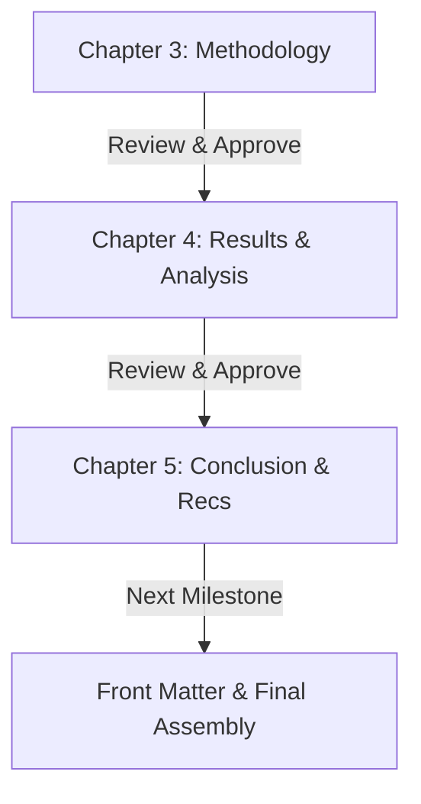

# Implementation Plan: Refining Chapters 3 to 5 (Friendly, Accessible & Rigorous Engineering Narrative)

We are refining **Chapters 3, 4, and 5** sequentially to transform dense academic jargon into a **clear, friendly, and engaging engineering narrative** that is accessible to examiners, students, and practitioners alike, while maintaining solid technical correctness and GCTU handbook standards.

---

## User Preferences & Guiding Principles

1. **Friendly, Accessible Tone:** Explain the intuition and the "why" in plain, relatable language first, followed by clear formulas, diagrams, and metrics. Avoid overly dense, stiff academic jargon that makes reading exhausting.
2. **Sequential Flow (Ch 3 $\to$ Ch 4 $\to$ Ch 5):** Work through each chapter one at a time, reviewing and approving each before proceeding to the next.
3. **Pool of Battle Scars:** Weave in relevant real-world hurdles naturally (e.g., OOM memory upgrade, EKF transform race condition, active vision gimbal calibration, distance scale invariance) as engaging engineering stories.
4. **Model Names:** Leave model nomenclature as-is for now (logged to to-do list for later polish).
5. **GCTU Formatting Rules:** Preserve 1.5 line spacing, no first-line indentation (`\parindent 0pt`), minimum 3 sentences per paragraph, captions above tables and below figures.

---

## Proposed Sequential Roadmap

---

## Chapter-by-Chapter Plan

### Phase 1: Chapter 3 (System Design & Methodology)
- **Intuitive Hardware & Software Co-Design:** 
  - Explain *why* the architecture is split between an ESP32-S3 microcontroller (fast, deterministic motor pulses without OS lag) and a Raspberry Pi 5 (running ROS 2 and the neural perception models).
  - Clarify the 3-container Docker setup in plain terms (why separating drivers, micro-ROS, and cognition prevents software headaches).
- **Relatable Memory & Resource Story (Battle Scar #1):**
  - Tell the 2GB vs. 8GB RAM story simply: when SLAM, YOLO, and MediaPipe ran together on 2GB, the Linux kernel ran out of memory and abruptly shut things down. Upgrading to 8GB gave the robot plenty of breathing room.
- **Plain-English Math & Invariance (Battle Scar #5 & #6):**
  - Explain *why* raw pixel coordinates fail when an operator steps back (hands appear smaller), and how measuring angles and palm ratios makes gestures identical at any distance.
  - Explain the central spatial-zone filter as an intuitive "spotlight" that ignores background bystanders.
- **Visual Servoing & State Machine Intuition:**
  - Break down the 4 states (IDLE, WAITING, LOCKED, EXECUTING) and the proportional steering ($v_\omega = -K_p e_x$) as simple, reactive tracking.
- **SLAM & Localization Fixes (Battle Scar #2):**
  - Explain the EKF transform race condition and why disabling yaw fusion in the EKF let the LiDAR build sharp, crisp maps instead of spinning starbursts.

### Phase 2: Chapter 4 (Testing, Results and Analysis)
- **Engaging Test Story:**
  - Sensor checks under real-world conditions (bright vs. dim lighting, lidar range).
  - Physical interaction trials with 3 participants (explaining why pointing gestures were 100% reliable, and why the palm STOP had slight tilt sensitivity).
- **Physical Robot Actuation (Table 4.3):**
  - Walk through how the robot translated gestures into smooth physical movements and quick stops.
- **Obstacle & Safety Testing (Table 4.4):**
  - Explain the reactive LiDAR safety buffer: how the robot halts safely within 0.35 m before hitting walls or people.
- **The 132 ms Latency Budget in Human Terms:**
  - Explain the 132 ms end-to-end response time using a relatable comparison: a human eye blink takes ~100–150 ms, so the robot responds essentially instantaneously to human gestures.
- **Addressing the 4 ERQs:**
  - Present the answers to the 4 research questions as clear, satisfying takeaways.

### Phase 3: Chapter 5 (Conclusion and Recommendations)
- **Reflective Summary:**
  - A friendly synthesis of what was accomplished, celebrating the success of edge-only HRI without expensive GPUs or cloud servers.
- **Honest Limitations:**
  - Clearly discussing lighting sensitivity, participant sample size, and navigation constraints.
- **Practical Recommendations:**
  - Tangible tips and next steps for future students or engineers (PID gimbal tracking, sensor fusion, biometric recognition).

---

## Verification Plan

### Verification Steps
1. Review LaTeX syntax, balance all environments, verify all table and figure references.
2. Confirm paragraph rule (all paragraphs have at least 3 sentences and no indentation).
3. Confirm tone is friendly, engaging, and clear while technically sound.
