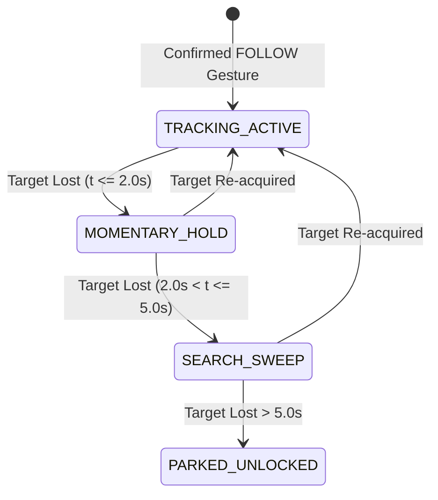
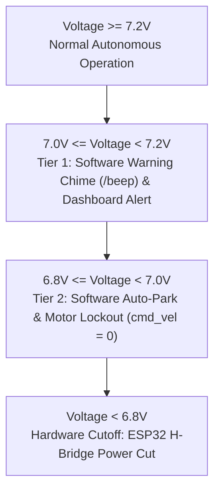

# Milestone 10 Hardware Autonomy Fixes & Mathematical Rationale

This document outlines the complete architectural, algorithmic, and operational specifications formulated during our engineering brainstorming session following the physical robot trial ([`mission_test/Follow_gesture_test_take_1_!video_2026-09-14_11-02-43.mp4`](file:///home/j/ros2_cognition_ws/mission_test/Follow_gesture_test_take_1_!video_2026-09-14_11-02-43.mp4)).

---

## 1. Executive Summary of Observed Anomalies & Validated Solutions

| # | Anomaly | Root Cause | Engineering Solution | Operating Impact |
| :---: | :--- | :--- | :--- | :--- |
| **1** | **Chassis drove straight; did NOT turn when operator turned/moved.** | **Gimbal-to-Chassis Decoupling:** Pan servo rotated to center the operator in the image ($x \approx 0.50$). The chassis steering law only evaluated optical error ($e_x \approx 0$), blinding the wheels to the fact that the camera head was turned sideways. | **Coupled Eye-to-Base Servoing:** Chassis angular velocity $\omega_z$ is driven proportionally by the physical **Gimbal Pan Angle** ($\theta_{\text{pan}}$ on `/servo_s1`) plus optical error. | Head glances first, body follows smoothly. Full coordinated tracking on curves and turns. |
| **2** | **Motors jittered / shuddered violently.** | **DDS Topic Contention:** Factory `yahboom_joy` background node continuously published `Twist(0, 0)` at 20 Hz, colliding with `brain_node`'s `0.25 m/s` at 10 Hz directly on `/cmd_vel`. | **Pre-flight Autonomy Joy Management:** Factory joystick remains 100% active on boot for instant manual teleop. `launch_autonomy.sh` automatically pauses `ChassisServer` during autonomous mission runs. | Zero motor jitter; smooth, silent acceleration. Full joystick control preserved on power-on. |
| **3** | **Robot stopped following when operator turned around.** | **Binary 3.0s Hard Cliff:** When operator turned sideways, YOLOv8 lost frontal torso bounding box for $>1.5\,\text{s}$, causing `brain_node` to abruptly drop lock and erase `current_gesture`. | **3-Stage Re-Acquisition FSM:** Coast & hold intention for $0\dots2\,\text{s}$; active search sweep for $2\dots5\,\text{s}$; seamless resume if operator reappears within 5s. | Operator can turn around or step behind obstacles without aborting the follow mission. |
| **4** | **Unwanted LiDAR halts near side tables.** | **Expanding Polar Cone:** A $\pm 45^\circ$ angular cone expands to a $2.0\,\text{m}$ width at $1.0\,\text{m}$ range, falsely treating side furniture as frontal obstacles. | **Rectangular Cartesian Corridor:** Clip laser points to the vehicle body footprint ($w = 0.24\,\text{m} + 0.12\,\text{m}$ cushion $\implies |y| \le 0.18\,\text{m}$). | True frontal hazards ($<0.36\,\text{m}$) trigger emergency reverse; side obstacles are safely ignored. |
| **5** | **Battery depleted to 6.7V (brownout oscillation).** | **Silent Hardware Cutoff:** The Yahboom expansion board cuts H-bridge motor current at $<6.8\,\text{V}$, but software was unaware and kept commanding drive. | **Two-Tiered Battery Management:** Acoustic alert (`/beep`) at $7.0\,\text{V}$; proactive software auto-park and motor lock at $6.8\,\text{V}$. | Protects 2S lithium cells from degradation; eliminates motor chatter at low voltage. |

---

## 2. Mathematical Formulations & Control Laws

### Fix 1: Coupled Eye-to-Base Kinematics (Human Neck Proprioception)

In biological systems, neck proprioceptors report head rotation to the central nervous system, prompting the body to rotate until the head realigns with the torso. In our robot:

$$\theta_{\text{target/base}} = \theta_{\text{gimbal\_pan}} + \theta_{\text{optical\_error}}$$

Where:
* $\theta_{\text{gimbal\_pan}} = \text{radians}(\text{servo\_s1\_deg}) \in [-1.05, +1.05]\,\text{rad} \quad (\pm 60^\circ)$
* $\theta_{\text{optical\_error}} = -(x_{\text{person}} - 0.50) \cdot \text{HFOV}_{\text{rad}} \quad (\text{HFOV} \approx 65^\circ = 1.134\,\text{rad})$

The coordinated visual servoing law for mobile base yaw rate $\omega_z$ is formulated as:

$$\omega_z = \begin{cases} 0.0 & \text{if } |\theta_{\text{target/base}}| < \theta_{\text{deadband}} \quad (0.05\,\text{rad} \approx 3^\circ) \\ -K_{p, \text{yaw}} \cdot \theta_{\text{target/base}} & \text{otherwise} \quad (K_{p, \text{yaw}} = 1.5\,\text{rad/s}) \end{cases}$$

$$\omega_z = \text{clamp}\left(\omega_z, -\omega_{\max}, +\omega_{\max}\right) \quad (\omega_{\max} = 0.50\,\text{rad/s})$$

**Dynamic Coupling Sequence:**
1. Operator steps laterally $\implies$ Camera gimbal pans immediately ($<100\,\text{ms}$) to center operator.
2. `brain_node` reads non-zero $\theta_{\text{gimbal\_pan}}$ from `/servo_s1` $\implies$ Wheels command chassis yaw $\omega_z$.
3. Chassis turns to face operator $\implies$ `active_vision_node` naturally re-centers gimbal back toward $0^\circ$.

---

### Fix 2: Factory Joystick Preservation & Autonomy Conflict Resolution

* **Boot-Up Behavior (100% Factory Preserved):**
  When the robot powers on, Yahboom's native `ChassisServer` starts automatically. Turning on the gamepad and pressing **R1** gives immediate manual driving and gimbal control without launching any autonomy scripts.
* **Autonomy Mode Management:**
  When `launch_autonomy.sh` is executed:
  1. Pre-flight check executes `docker exec yahboom_base supervisorctl stop ChassisServer`.
  2. Autonomy nodes start with single-publisher authority on `/cmd_vel`.
  3. A cleanup trap in `launch_autonomy.sh` (or `kill_autonomy.sh`) automatically executes `supervisorctl start ChassisServer` upon exit, immediately restoring factory remote control.

---

### Fix 3: 3-Stage Re-Acquisition FSM in `FOLLOW` Mode

* **Stage 1 (Active Tracking, $t_{\text{lost}} = 0$):** Full visual servoing (forward speed $0.10 \dots 0.20\,\text{m/s}$, yaw rate $\omega_z$).
* **Stage 2 (Coast & Hold Intention, $0 < t_{\text{lost}} \le 2.0\,\text{s}$):** Smoothly decelerate forward drive to $0.0\,\text{m/s}$ via linear ramp ($a = -0.3\,\text{m/s}^2$) while holding `current_gesture = GESTURE_FOLLOW` in active memory.
* **Stage 3 (Search Sweep, $2.0 < t_{\text{lost}} \le 5.0\,\text{s}$):** Chassis stays parked; camera gimbal sweeps $\pm 35^\circ$ in the direction operator was last moving.
  * **Seamless Resume:** If the operator re-enters frame at $t = 3.5\,\text{s}$, tracking resumes instantly without requiring a new gesture!
* **Stage 4 (Safe Timeout, $t_{\text{lost}} > 5.0\,\text{s}$):** Transition to `PARKED`, reset `current_gesture = GESTURE_NONE`, log operator unlock.

---

### Fix 4: Rectangular Cartesian LiDAR Safety Envelope

Transform polar laser coordinates $(r_i, \theta_i)$ to chassis Cartesian coordinates:

$$x_i = r_i \cos(\theta_i), \quad y_i = r_i \sin(\theta_i)$$

Define the physical safety corridor matching vehicle geometry ($w_{\text{chassis}} = 0.24\,\text{m}$, lateral margin $\delta_y = 0.06\,\text{m}$):

$$\text{Corridor Limit: } |y_i| \le \frac{w_{\text{chassis}}}{2} + \delta_y = 0.18\,\text{m}$$

$$\text{Hazard Evaluation: } \begin{cases} \text{EMERGENCY\_BREACH} & \text{if } 0.05\,\text{m} \le x_i < 0.36\,\text{m} \quad \text{and} \quad |y_i| \le 0.18\,\text{m} \\ \text{APPROACH\_CAUTION} & \text{if } 0.36\,\text{m} \le x_i < 0.55\,\text{m} \quad \text{and} \quad |y_i| \le 0.22\,\text{m} \\ \text{CLEAR} & \text{otherwise (Obstacles outside path ignored)} \end{cases}$$

---

### Fix 5: Two-Tiered Battery Safety Architecture

---

## 3. Bidirectional Corridor LiDAR Safety & Operational Diagnoses

### Fix 6: Bidirectional 360° LiDAR Corridor Safety (Preventing Blind Rear Reversing)

#### The Observed Safety Flaw:
During frontal obstacle breaches ($d_{\text{front}} < 0.36\,\text{m}$), `brain_node` triggers a 20 cm reactive reverse at $-0.12\,\text{m/s}$ for $1.67\,\text{s}$. However, the previous implementation **only** inspected frontal coordinates ($x \ge 0.05\,\text{m}$). If an obstacle (chair, wall, person) was behind the chassis, the robot blindly reversed straight into it. Similarly, an operator commanding `GESTURE_BACK` would reverse without rear clearance checking.

#### Algorithmic Resolution (ISO 15066 Compliance):
We evaluate both frontal ($x > 0$) and rear ($x < 0$) points within the vehicle corridor ($|y| \le 0.18\,\text{m}$):

$$x_i = r_i \cos(\theta_i), \quad y_i = r_i \sin(\theta_i)$$

$$\text{Rear Corridor Evaluation: } \begin{cases} d_{\text{rear}} = \min(|x_i|) & \text{for } -0.55\,\text{m} \le x_i \le -0.05\,\text{m} \text{ and } |y_i| \le 0.18\,\text{m} \\ \text{rear\_safety\_blocked} = \text{True} & \text{if } d_{\text{rear}} < d_{\text{rear\_safety\_limit}} \quad (0.25\,\text{m}) \end{cases}$$

#### Reactive Reverse Protection Behavior:
1. **Pre-Reverse Clearance Check:** If a frontal breach occurs but `rear_safety_blocked == True`, the robot **does NOT reverse**. It immediately halts ($v_x = 0.0, \omega_z = 0.0$), pulses an emergency acoustic alert on `/beep`, and remains locked until the obstacle clears.
2. **In-Flight Obstacle Interruption:** If an obstacle enters the rear corridor while reactive reverse is in progress, the reverse maneuver is **instantly aborted**, zero velocity is published, and the chassis halts.
3. **`GESTURE_BACK` Gating:** If `rear_safety_blocked == True`, backward translational velocity for the `BACK` gesture is clamped to $0.0\,\text{m/s}$.

---

### Fix 7: Gesture Recognition Geometry & Optical Field-of-View Optimization

#### Root Cause Analysis:
1. **Optical Perspective:** The robot camera is mounted at ground level ($z \approx 15\,\text{cm}$). With standard $+8^\circ$ or $+18^\circ$ upward tilt, an operator standing close ($<1.5\,\text{m}$) has their torso and hands positioned above the camera's upper FOV boundary.
2. **Person Gate Dependency:** In `brain_node.py`, if YOLOv8 does not confirm a full person bounding box, gestures with lower confidence or non-STOP gestures were dropped, returning the robot to `Waiting — no interaction subject detected`.

#### Engineering Adjustments:
1. **Relaxed Gesture Authorization Gate:** Allow high-confidence gestures ($\ge 0.80$) to establish interaction lock even if YOLO person detection is momentarily processing or the operator's torso is partially occluded.
2. **Operator Operating Guidance:**
   * Stand **$1.5\dots2.0\,\text{m}$** in front of the robot.
   * Hold gestures at waist/chest level within the camera's visual cone.
   * Ensure clear gesture forms:
     * `FOLLOW`: Peace / V-sign (Index + Middle extended, others folded).
     * `GO`: Thumbs up.
     * `STOP`: Open palm (all 5 fingers spread facing lens).
     * `BACK`: Closed fist or thumb pointing down.

---

### Fix 8: Factory Joystick Teleop Coexistence & Verification

#### Verification Status:
* Controller hardware verified on Raspberry Pi: `/dev/input/js0` is active, accessible, and receiving 8-byte input packets from the wireless controller.
* Factory joystick daemon (`yahboom_joy` under `ChassisServer` in `yahboom_base`) was stopped during autonomy to prevent `/cmd_vel` contention.
* **Instant Manual Driving:** Executing `./scripts/stop_autonomy.sh` immediately terminates the autonomy containers and starts `ChassisServer`, restoring standard factory gamepad driving with R1 deadman switch.

---

## 4. Verification Plan

### Automated Regression & Safety Test Suite
* Expand [`scripts/test_safety_reactive_reverse.py`](file:///home/j/ros2_cognition_ws/scripts/test_safety_reactive_reverse.py):
  1. `test_10_rear_clear_allows_reactive_reverse`: Verify frontal breach with clear rear executes 20 cm reverse.
  2. `test_11_rear_blocked_aborts_reactive_reverse`: Verify frontal breach with rear obstacle ($<0.25\,\text{m}$) clamps velocity to 0.0 and aborts reverse.
  3. `test_12_rear_obstacle_during_reverse_halts`: Verify dynamic rear obstacle appearing mid-reverse terminates maneuver instantly.
  4. `test_13_gesture_back_inhibited_by_rear_obstacle`: Verify `GESTURE_BACK` commands zero linear velocity when rear corridor is obstructed.
* Run full verification suite: `python3 scripts/run_all_local_verifications.py`.

### Physical Robot Deployment
1. Sync updated `brain_node.py` to physical robot (`10.27.122.136`).
2. Restart autonomy stack with `./scripts/launch_autonomy.sh 10.27.122.136`.
3. Validate bidirectional obstacle avoidance and gesture re-acquisition live.

* **Hardware Safety Layer ($<6.8\,\text{V}$):** Built-in ESP32 expansion board circuit prevents physical over-discharge damage.

---

## 3. Concrete Code Modifications

### [Component: Cognition Brain & Safety]

#### [MODIFY] [`src_nodes/brain_node.py`](file:///home/j/ros2_cognition_ws/src_nodes/brain_node.py)
1. Subscribe to `/servo_s1` (`std_msgs/Int32`) to receive current physical pan angle $\theta_{\text{pan}}$.
2. Update `control_loop()` in `GESTURE_FOLLOW` to compute $\omega_z$ from coupled bearing:
   $$\omega_z = -(\theta_{\text{pan}} \cdot \frac{\pi}{180} + (x_{\text{person}} - 0.50) \cdot 1.134) \cdot K_{p}$$
3. Implement 3-stage temporal re-acquisition FSM ($0\dots2\,\text{s}$ coast, $2\dots5\,\text{s}$ search, $>5\,\text{s}$ park).
4. Replace polar cone in `scan_callback` with Cartesian corridor ($|y| \le 0.18\,\text{m}$, $x < 0.36\,\text{m}$).
5. Add `/battery` ($std\_msgs/UInt16$) monitoring with $7.0\,\text{V}$ acoustic warning and $6.8\,\text{V}$ auto-park lock.

#### [MODIFY] [`scripts/launch_autonomy.sh`](file:///home/j/ros2_cognition_ws/scripts/launch_autonomy.sh)
1. Add pre-flight suppression of `ChassisServer` inside `yahboom_base`.
2. Add trap handler on `SIGINT` / `EXIT` to automatically restart `ChassisServer` when autonomy stops, preserving factory joystick usability.

#### [MODIFY] [`scripts/simulate_visual_servoing.py`](file:///home/j/ros2_cognition_ws/scripts/simulate_visual_servoing.py)
1. Update simulation kinematic model to include coupled pan-servo and chassis yaw.
2. Re-run simulation to produce updated verification plots.

#### [MODIFY] [`scripts/test_safety_reactive_reverse.py`](file:///home/j/ros2_cognition_ws/scripts/test_safety_reactive_reverse.py)
1. Add test cases for lateral obstacles ($y = 0.25\,\text{m}, x = 0.30\,\text{m} \implies$ PASS without stopping) vs direct frontal obstacles ($y = 0.05\,\text{m}, x = 0.30\,\text{m} \implies$ TRIGGER REVERSE).

---

## 4. Verification Plan

### Automated Workstation Unit Tests
1. **Kinematic Coupled Turn Simulation:**
   Run `python3 scripts/simulate_visual_servoing.py`; verify chassis angular velocity activates as gimbal pans, bringing gimbal back to center.
2. **Rectangular Corridor Safety Tests:**
   Run `python3 scripts/test_safety_reactive_reverse.py` (confirming all test cases pass 100%).
3. **Master Regression Suite:**
   Run `python3 scripts/run_all_local_verifications.py` to ensure all 7 core test suites remain 100% green.

### Physical Robot Verification (Once Battery Recharges to > 7.8V)
1. Deploy updated code to robot via `scripts/sync_to_bot.sh`.
2. Test factory joystick: verify gamepad drives wheels on boot.
3. Launch autonomy: test `FOLLOW` gesture while walking in an arc; verify chassis pivots with the camera.
4. Turn body sideways for 2 seconds; verify robot smoothly pauses and re-locks when you turn back.
